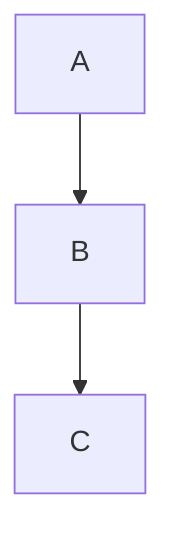
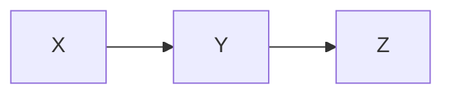

# export-diagram

Export Mermaid diagrams from markdown files as PNG/SVG images.

## Usage

```
/export-diagram [path-to-markdown-file.md] [--format png|svg] [--output path/to/output]
```

**Examples:**
```
# Export all diagrams from a markdown file (defaults to PNG)
/export-diagram 04-Initiatives/4.13 Global Redemptions/flow-diagram.md

# Export as SVG with custom output directory
/export-diagram 04-Initiatives/4.13 Global Redemptions/flow-diagram.md --format svg --output ./diagrams

# Export specific diagram by name
/export-diagram 04-Initiatives/4.13 Global Redemptions/flow-diagram.md --diagram "User Flow Diagram"
```

## What This Does

This command takes a markdown file with Mermaid diagrams and:

1. **Parses the markdown** - Extracts all mermaid code blocks
2. **Identifies diagrams** - Finds section headers and diagram names
3. **Renders to images** - Converts Mermaid diagrams to PNG or SVG format
4. **Saves outputs** - Creates image files in specified output directory
5. **Returns results** - Provides paths to generated images

## Output

Generated image files follow this naming pattern:
- `[section-name]_[diagram-title].[format]`
- Example: `global-redemptions_user-flow-diagram.png`

If no title found, uses sequential numbering:
- Example: `diagram-1.png`, `diagram-2.png`

## Options

### --format
- `png` (default) - Raster PNG format, smaller file size, good for web
- `svg` - Scalable Vector Graphics, crisp at any size, better for printing

### --output
- Directory path where images will be saved
- Default: Same directory as input markdown file
- Creates directory if it doesn't exist

### --diagram
- Export specific diagram by section name or title
- If not specified, exports all diagrams

### --theme
- `default` (default) - Standard Mermaid theme
- `dark` - Dark theme variant
- `forest` - Forest color scheme
- `neutral` - Neutral/grayscale

### --width
- Image width in pixels (PNG only)
- Default: 1024
- SVG scales automatically

### --height
- Image height in pixels (PNG only)
- Default: auto-calculated based on content
- SVG scales automatically

## Workflow

1. **Read markdown file** - Load and parse markdown
2. **Extract Mermaid blocks** - Find all ```mermaid code blocks
3. **Render each diagram** - Convert to image using Mermaid CLI/service
4. **Save images** - Write to output directory with descriptive names
5. **Report results** - Show all generated image files and their paths

## Examples

### Basic Export (PNG)
```
/export-diagram flow-diagram.md
```
Output:
```
✅ Exported 4 diagrams

📊 Generated Images:
1. user-flow-diagram.png (1024×2048)
2. system-architecture.png (1024×768)
3. product-requirements-priority-map.png (1024×512)
4. partner-pipeline-opportunities.png (1024×896)

📁 Location: ./diagrams/
```

### Export as SVG with Custom Output
```
/export-diagram flow-diagram.md --format svg --output ./assets/diagrams
```
Output:
```
✅ Exported 4 diagrams as SVG

📊 Generated Files:
1. user-flow-diagram.svg
2. system-architecture.svg
3. product-requirements-priority-map.svg
4. partner-pipeline-opportunities.svg

📁 Location: ./assets/diagrams/
```

### Export Specific Diagram
```
/export-diagram flow-diagram.md --diagram "User Flow Diagram" --format svg
```
Output:
```
✅ Exported "User Flow Diagram" as SVG

📊 Generated File:
user-flow-diagram.svg (2048×4096)

📁 Location: ./
```

### Dark Theme Export
```
/export-diagram flow-diagram.md --theme dark --format png --width 1280
```

## File Structure Expected

The markdown file should contain Mermaid diagrams in code blocks:

```markdown
# Section Title

## Diagram Name



## Another Diagram


```

Headers immediately before Mermaid blocks are used as diagram names in exported files.

## Output File Naming

Diagram names are derived from:
1. **H2 or H3 header immediately before diagram** (preferred)
2. **First header text in section** (fallback)
3. **Sequential numbering** (if no headers found)

Filenames are:
- Converted to lowercase
- Spaces replaced with hyphens
- Special characters removed
- Format extension added

Example transformations:
- "User Flow Diagram" → `user-flow-diagram.png`
- "System Architecture" → `system-architecture.png`
- "Step 1: Process Flow" → `step-1-process-flow.png`

## Error Handling

**File not found**
- Invalid path or file doesn't exist
- Action: Verify file path and try again

**No diagrams found**
- Markdown file has no Mermaid code blocks
- Action: Ensure file contains ```mermaid code blocks

**Diagram rendering failed**
- Invalid Mermaid syntax in diagram
- Action: Check diagram syntax and fix errors

**Output directory error**
- Cannot write to output directory
- Action: Check directory permissions or specify different output path

**Format not supported**
- Only PNG and SVG supported
- Action: Use `--format png` or `--format svg`

## Performance

- **PNG export**: ~1-2 seconds per diagram (includes rendering)
- **SVG export**: ~1 second per diagram (vector, faster)
- **Batch export**: ~0.5 seconds per additional diagram

Large diagrams (>5000 nodes) may take longer.

## Integration with Other Commands

After exporting diagrams:

1. **Add to PRD** - Include exported images in PRD documentation
2. **Share in Linear** - Attach exported images to Linear project tasks
3. **Present to stakeholders** - Use in presentations or design reviews
4. **Archive** - Store SVG versions for long-term archival

## Tips for Best Results

1. **Use clear diagram titles** - H2/H3 headers before diagrams
2. **Validate Mermaid syntax** - Test diagrams locally before exporting
3. **Choose appropriate format** - PNG for web, SVG for printing/scaling
4. **Set width for consistency** - Use `--width 1024` for standard size
5. **Use themes wisely** - Dark theme for dark mode interfaces
6. **Organize output** - Create `diagrams/` or `assets/` directory for exports

## Supported Diagram Types

All standard Mermaid diagram types are supported:
- Flowcharts (graph, flowchart)
- Sequence diagrams
- Class diagrams
- State diagrams
- Entity relationship diagrams (ER)
- Gantt charts
- Pie charts
- Gitgraph diagrams
- Mind maps
- C4 diagrams

## Related Commands

- `/prd` - Create or refine PRD documents with diagrams
- `/publish-prd` - Publish PRD with diagrams to Linear
- `/documentation` - Generate documentation with visual diagrams
- `/mockup` - Create UI mockups alongside diagrams

## Notes

- Exported images preserve all styling and colors from markdown
- SVG format is lossless and infinitely scalable
- PNG format is optimized for web use with compression
- Diagram names help organize multiple exports
- Output directory is created if it doesn't exist
- Existing files are overwritten without warning (can add `--preserve` flag to skip)
