# Global Redemptions - Flow Diagram

```mermaid
graph TD
    A["Partner App<br/>(e.g., PEXX)"] -->|"User clicks<br/>Redeem to Miles"| B["HeyMax<br/>Redemption Portal<br/>(Co-branded)"]
    
    B --> C{First Time<br/>User?}
    
    C -->|Yes| D["Step 1: Accept T&C<br/>& Account Linking"]
    D -->|"Share email, phone,<br/>country, name"| E["HeyMax Account<br/>Created via API<br/>(1:1 binding)"]
    
    C -->|No| F["Step 2: Dashboard<br/>Show Balances"]
    E --> F
    
    F --> G["Show Available<br/>Airline Partners<br/>(Configured)"]
    G --> H["User Selects<br/>Airline Partner"]
    
    H --> I{Airline Account<br/>Linked?}
    I -->|No| J["Step 3: Link<br/>Airline Account<br/>(Loyalty Number)"]
    J --> K["Step 4: Input Transfer Amount"]
    I -->|Yes| K
    
    K --> O["Step 5: Process<br/>& Confirm"]    
    O --> Q["Transfer History<br/>Updated<br/>(Funding + Redemption)"]
    
    R["Partner Support<br/>Portal"] -->|"Lookup by User ID<br/>or Transaction ID"| S["View Transaction<br/>Details & Status<br/>→ Escalate if needed"]
    
    style A fill:#e1f5ff,color:#000
    style B fill:#fff3e0,color:#000
    style E fill:#f3e5f5,color:#000
    style R fill:#fce4ec,color:#000
```

    
Step 5 -> 6
1. Partner holds Y points via API  
2. HeyMax does point conversion from Y points to X Max Miles  
3. HeyMax deposits X Max Miles into user's account  
4. HeyMax transfers to partner airline for X Max Miles worth of partner miles 
5. HeyMax receives confirmation for transfer and returns webhook to Partner
