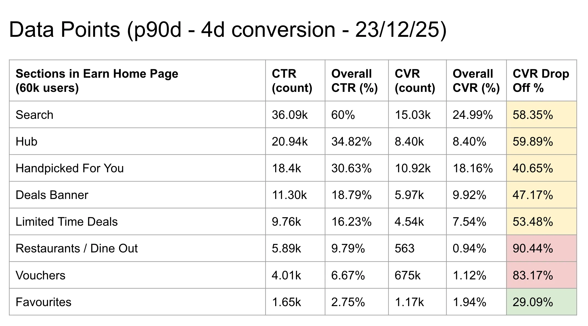

# Intent Category Updates & Experiment

## Problem / Objective

Users are not exploring intent categories beyond their current purchasing patterns. We need to increase category exploration to help users discover more earning opportunities and drive mile transactions.

---

## What success looks like

- **Primary metric**: 10% uplift in CTR into intent categories for experiment cohort
- **Secondary metric**: Uplift in # of mile transactions
- **Guardrail:**
  - mile transactions

---

## Supporting signals / Data

- hub icon is 34% of total home page clicks
- positions 7+ essentially kills discoverability
  - Data points for hub icons below

Data points for hub icons
{687x381}

| Position | section name | p90d count click | % | notes |
| --- | --- | --- | --- | --- |
| 5 | buy_vouchers | 43.61K | 40.29 |  |
| 4 | book_travel | 21.63K | 19.98 |  |
| 3 | shop_with_max | 15.32K | 14.15 |  |
| 2 | jre_campaign_pilot | 9.26K | 8.55 |  |
| 6 | dine_out | 5.17K | 4.78 |  |
| 1 | new_deals | 3.42K | 3.16 | launched 24 dec '26, so effectively live only on 20 days |
| 12 | chocolate_finance | 3.26K | 3.01 |  |
| 10 | apply_card | 2.14K | 1.98 |  |
| 8 | book_ride | 1.63K | 1.51 |  |
| 7 | order_food | 1.06K | 0.98 |  |
| 9 | buy_groceries | 904 | 0.84 |  |
| 11 | buy_insurance_with_max | 819 | 0.76 |  |

Business Team

1. "Shop online" category serves as an overly broad catch-all, lumping together disparate merchant types (investments, offline spend, etc.), creating confusion and poor discoverability

---

## Who is this for

All app users, particularly those with limited category exploration patterns

---

## Product requirements

| # | User story | Acceptance criteria |
| --- | --- | --- |
| 1 | As a user, I want to see varied intent categories when I open the app | Intent categories are randomised upon app opening |
| 2 | As a user, I want to discover new earning opportunities | Categories where I've already made purchases are moved to the back of the ranking |
| 3 | As a user, I want to have better visibility into merchants based on their category | Three new categories are visible: \n1. FX & Business Spend, \n2. Shop offline, and \n3. Invest |
### New Intent Categories
| Category | Status | New Merchants |
| --- | --- | --- |
| FX & Biz | 🆕 | Airwallex, Revolut |
| Shop offline | 🆕 | Atome, Chocolate Finance |
| Invest | 🆕 | Webull, Syfe, Longbridge |
---

## Experiment Design

Phase 1 (part 1)

1. Hypothesis: CTR of intent category depends upon of rank visibility
  1. **Visual randomisation**: Randomising the intent categories upon opening the app will give a visual queue to users that there is something new -> leading to increased user engagement with categories
    1. once per day
    2. fixed: new_deals section

Phase 1 (part 2 after part 1)

1. Hypothesis: CTR of intent category depends upon of relevance/utility
  1. **Grid Chevron:** Adopting a grid view will be more intuitive for users to explore categories beyond position 7
    1. Success: # of clicks on position 7+ categories

Phase 2

1. Hypothesis: CTR of intent category depends upon of associated "newness"
  1. **Highlighted Intent Category UX**: Having a visual highlight to "recommended" intent categories will increase CTR and CVR to that specific intent category
  2. **Personalised ranking**: Hiding intent categories that users are already purchasing at in favour of unexplored categories will encourage exploration
    1. Logic: If user made a transaction with a merchant in that intent category, move it to the back of the ranking
    2. requires tracking of whether user made a transaction of the same intent category
    3. fixed: new_deals section

### Experiment Groups

- **Control**: Static Hub Intent Icons
- **Split**: 50-50

---

## Events tracking

| Event name | Event attributes | Description | status |
| --- | --- | --- | --- |
| home_page:click | section: hub\nname: 'offline_spend', 'fx_business', 'invest' | add intent categories | new |
| home_page:click | position: 1/2/3/4/5/6/7/8/9/10/11 | Tracks category position on the hub icons | new |

---

## FAQs

---

## Risks & Mitigations

| Risk | Impact | Mitigation |
| --- | --- | --- |
| New merchant integrations may have technical delays | H | Begin merchant onboarding early; have fallback plan |
| Deprioritising familiar categories may frustrate power users | M | Monitor negative feedback; consider hybrid approach |
| Users may feel disoriented by randomisation | M | Include subtle visual cues or maintain some consistency |

---

## Launch checklist

- [ ] Experiment plan defined (cohort split, duration, success criteria)
- [ ] Tracking events implemented and validated
- [ ] New merchant integrations completed (Airwallex, Revolut, Atome, Chocolate Finance, Webull, Syfe, Longbridge)
- [ ] Randomisation logic implemented and tested
- [ ] Ranking algorithm updated with transaction history logic
- [ ] Customer.io campaigns setup
- [ ] QA completed for all variants
- [ ] Rollback plan documented

---

## Appendix

[Supporting research, mockups, technical specs for randomization and ranking algorithms]
